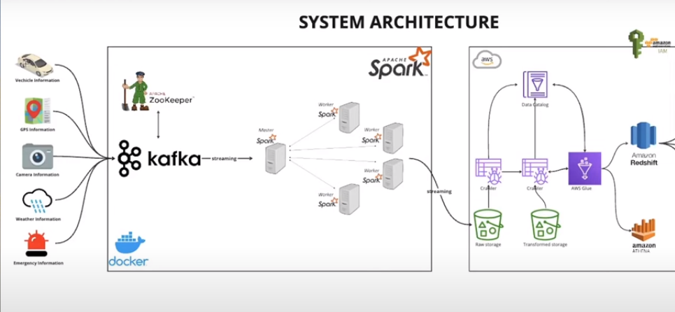

# smartCity-DE

Smart City End to End Realtime data streaming pipeline covering each phase from data ingestion to processing and finally storage. We'll utilize tools like IOT devices, Apache Zookeeper, Apache Kafka, Apache Spark, Docker, Python, AWS Cloud, AWS Glue, AWS Athena, AWS IAM, AWS S3.
1. Produce mock data.
2. Ingest into Kafka
3. Read Kafka-Topics using Spark.
4. Ingest data in s3.
5. Make athena Tables using Crawler. 

